<div align="center">

# 🛡️ DEVO SIEM Use Case Library


### Enterprise-Grade Security Detection Platform

[](https://github.com/Masriyan/DevoSIEM_UCL)
[](INDEX.md)
[](https://attack.mitre.org/)
[](LICENSE)
[](DEVO_QUERY_SYNTAX_GUIDE.md)

**A comprehensive, production-ready collection of advanced SIEM detection rules and correlation use cases for DEVO Security Operations Platform.**

[📚 Documentation](#documentation) • [🚀 Quick Start](#quick-start) • [📊 Use Cases](#-use-case-categories) • [💡 Examples](#-real-world-threat-scenarios) • [🤝 Contributing](CONTRIBUTING.md)

</div>

---

<div align="center">

### 🎯 Battle-Tested Detection Logic | 🔄 Multi-Stage Correlations | 🌐 Modern Cloud-Native Coverage

</div>

---

> **⚠️ Important Notice:** This is a community-driven project and is **NOT officially affiliated with, sponsored by, or endorsed by DEVO Technology**. This library is independently created and maintained for educational and professional use by security practitioners.

## 📑 Table of Contents

- [Overview](#overview)
- [Statistics & Metrics](#-statistics--metrics)
- [What's New](#-whats-new-in-v200)
- [Repository Structure](#-repository-structure)
- [Use Case Categories](#-use-case-categories)
- [Real-World Scenarios](#-real-world-threat-scenarios)
- [Quick Start](#-quick-start)
- [Implementation Roadmap](#-implementation-roadmap)
- [Documentation](#-documentation)
- [Version History](#-version-history)
- [Contributing](#-contributing)

---

## 🎯 Overview

This repository contains **52 production-ready SIEM use cases** covering multiple security domains, modern cloud-native technologies, and advanced threat scenarios. Each use case is designed to detect specific threats, suspicious activities, or policy violations with detailed response playbooks, forensic guidance, and MITRE ATT&CK mappings.

<details>
<summary><b>🌟 What Makes This Library Unique</b> (Click to expand)</summary>

<br>

| Feature | Description | Value |
|---------|-------------|-------|
| ✅ **Production-Ready Queries** | Official DEVO LINQ syntax, tested and verified | 99% syntax compliance |
| 🔗 **Advanced Correlation** | Multi-stage attack chain detection with complex event correlation | 7-stage ransomware detection |
| 🐳 **Modern Threat Coverage** | Container security, supply chain attacks, API security, SaaS governance | 7 new categories |
| 📖 **Comprehensive Documentation** | Response playbooks, investigation steps, and prevention measures | Every use case |
| 🎯 **MITRE ATT&CK Mapped** | Complete coverage of tactics, techniques, and sub-techniques | 60+ techniques |
| 🎛️ **Tuning Guidance** | False positive considerations and environment-specific tuning | Baseline recommendations |
| 💼 **Real-World Scenarios** | Based on actual attack campaigns and incident response experiences | 5 detailed walkthroughs |

</details>

---

## 📊 Statistics & Metrics

<div align="center">

### Use Case Distribution by Severity

```
┌─────────────────────────────────────────────────────────────┐
│ CRITICAL ████████████████████████ 23 (44%)                  │
│ HIGH     ████████████████████ 20 (38%)                      │
│ MEDIUM   ███████ 7 (14%)                                    │
│ LOW      ██ 2 (4%)                                          │
└─────────────────────────────────────────────────────────────┘
```

### Coverage Statistics

| Metric | Count | Details |
|:------:|:-----:|---------|
| 📋 **Total Use Cases** | **52** | Production-ready detection rules |
| 🚨 **CRITICAL Severity** | **23** | Immediate threat requiring urgent response |
| ⚠️ **HIGH Severity** | **20** | Serious security concern requiring prompt investigation |
| 📌 **MEDIUM Severity** | **7** | Notable security event requiring attention |
| ℹ️ **LOW Severity** | **2** | Informational alerts for monitoring |
| 🏢 **Security Categories** | **17** | Firewall, Cloud, Container, API, SaaS, etc. |
| 🎯 **MITRE ATT&CK Techniques** | **60+** | Complete kill chain coverage |
| ✅ **DEVO LINQ Compliance** | **99%** | Verified against official syntax |

</div>

---

### 📈 Growth Over Time

```
v1.0.0 (Nov 2024)    ████████████████░░░░░░░░░░░░  32 use cases
v1.1.0 (Dec 2024)    ████████████████████░░░░░░░░  43 use cases (+34%)
v2.0.0 (Dec 2025)    ████████████████████████████  52 use cases (+63% from v1.0.0)
```

<div align="center">

| Version | Use Cases | Increase | Key Additions |
|:-------:|:---------:|:--------:|---------------|
| v1.0.0 | 32 | - | Initial release |
| v1.1.0 | 43 | +34% | Threat Intelligence, Cloud expansion |
| v2.0.0 | **52** | **+63%** | **Container, Supply Chain, API, SaaS** |

</div>

## 🆕 What's New in v2.0.0

<div align="center">

### 🚀 Major Expansion - Advanced Threat Detection

**+21% More Use Cases** | **+7 New Categories** | **+60% More Techniques**

</div>

This release represents a significant evolution with **52 use cases** (21% increase from v1.1.0), introducing cutting-edge detection categories for modern cloud-native environments and sophisticated attack scenarios.

---

### ✨ NEW Categories

<table>
<tr>
<td width="33%" align="center">

#### 🐳 Container/Kubernetes
**3 Use Cases**

```
┌─────────────────┐
│  ☸️  K8s API    │
│  🔐 Secrets     │
│  ⛏️  Crypto     │
└─────────────────┘
```

- Container Escape 🔴
- Cryptomining 🔴
- Secret Access 🟠

</td>
<td width="33%" align="center">

#### 📦 Supply Chain
**1 Use Case**

```
┌─────────────────┐
│  📋 Dependencies│
│  🎭 Typosquat   │
│  🔍 SCA         │
└─────────────────┘
```

- Malicious Deps 🔴
- Dependency Confusion
- Package Backdoors

</td>
<td width="33%" align="center">

#### 🔗 Advanced Correlation
**1 Use Case**

```
┌─────────────────┐
│  1️⃣ Initial     │
│  2️⃣ Creds       │
│  3️⃣ Lateral     │
│  ...→ 7️⃣ Impact │
└─────────────────┘
```

- 7-Stage Ransomware 🔴
- Multi-Source Events
- Kill Chain Detection

</td>
</tr>
<tr>
<td width="50%" align="center" colspan="2">

#### 🔌 API Security
**1 Use Case**

```
┌──────────────────────────────────────┐
│  🔑 Key Management  │  📊 Rate Limits │
│  🌍 Geo Anomalies   │  📝 Log Exposure│
└──────────────────────────────────────┘
```

- API Key Abuse 🔴
- OAuth Monitoring
- Geographic Anomalies

</td>
<td width="50%" align="center">

#### ☁️ SaaS Security
**1 Use Case**

```
┌──────────────────────────────┐
│  👤 Shadow IT   │  📤 DLP    │
│  🔍 CASB        │  🌐 OAuth  │
└──────────────────────────────┘
```

- Shadow IT 🟠
- Unauthorized SaaS
- Data Exfiltration

</td>
</tr>
</table>

---

### 📈 Expanded Existing Categories

<div align="center">

| Category | v1.1.0 | v2.0.0 | Growth | Highlights |
|----------|:------:|:------:|:------:|------------|
| 🕵️ **Threat Intelligence** | 4 | 4 | ➡️ | IOC matching, APT detection, TOR/VPN usage |
| ☁️ **Cloud Security** | 15 | 15 | ➡️ | AWS, Azure, GCP comprehensive coverage |
| 🔥 **Firewall** | 11 | 11 | ➡️ | Palo Alto, Fortinet, Checkpoint |
| 🐳 **Container/K8s** | 0 | **3** | 🆕 | Cloud-native security |
| 📦 **Supply Chain** | 0 | **1** | 🆕 | Software composition security |
| 🔗 **Adv. Correlation** | 1 | **2** | +100% | Multi-stage attack detection |
| 🔌 **API Security** | 0 | **1** | 🆕 | API protection & governance |
| ☁️ **SaaS Security** | 0 | **1** | 🆕 | Shadow IT detection |

</div>

## 📁 Repository Structure

```
DevoSIEM_UCL/
├── Firewall/
│   ├── PaloAlto/              # 4 use cases - Threat prevention, WildFire, C2 detection
│   ├── Fortinet/              # 4 use cases - IPS, botnet, SQL injection, anomaly detection
│   └── Checkpoint/            # 3 use cases - Threat emulation, IPS, anti-bot
│
├── Cloud/
│   ├── AWS/                   # 6 use cases - GuardDuty, Lambda, Secrets Manager, Root account, S3, Security groups
│   ├── Azure/                 # 5 use cases - Admin consent, Global admin, Service principals, MFA, Conditional access
│   └── GCP/                   # 4 use cases - Service accounts, IAM, Firewall, External IPs
│
├── Container/
│   └── Kubernetes/            # 3 use cases (NEW!) - Container escape, cryptomining, secret access
│
├── SupplyChain/               # 1 use case (NEW!) - Malicious dependency injection, typosquatting
│
├── AdvancedCorrelation/       # 1 use case (NEW!) - Multi-stage ransomware kill chain
│
├── APISecurity/               # 1 use case (NEW!) - API key abuse, exfiltration, exposure
│
├── SaaS/                      # 1 use case (NEW!) - Shadow IT, unauthorized SaaS usage
│
├── ThreatIntelligence/        # 4 use cases - IOC matching, APT detection, TOR/VPN, domain reputation
│
├── IAM/                       # 3 use cases - Brute force, privilege escalation, password spray
│
├── Correlation/               # 1 use case - Kill chain lateral movement
│
├── ImpossibleTravel/          # 2 use cases - Geographic anomalies, concurrent sessions
│
├── InsiderThreat/             # 2 use cases - Mass exfiltration, pre-resignation data access
│
├── WAF/                       # 2 use cases - Web shell uploads, OWASP Top 10 violations
│
├── EDR/                       # 2 use cases - Ransomware indicators, credential dumping
│
├── EmailSecurity/             # 1 use case - Business Email Compromise (BEC)
│
├── Network/                   # 1 use case - DNS tunneling
│
└── DLP/                       # 1 use case - Sensitive data upload to cloud storage
```

## Severity Levels

Each use case is categorized by severity:

- **CRITICAL**: Immediate threat requiring urgent response (e.g., active exploitation, data exfiltration, ransomware)
- **HIGH**: Serious security concern requiring prompt investigation (e.g., privilege escalation, malware detection)
- **MEDIUM**: Notable security event requiring attention (e.g., policy violations, suspicious activities)
- **LOW**: Informational alerts for monitoring and compliance (e.g., configuration changes, baseline deviations)

## 🎯 Use Case Categories

### 🔥 Firewall (11 use cases)
Comprehensive next-generation firewall detection across major vendors.

**Palo Alto Networks** (4 use cases):
- WildFire malware detection (CRITICAL) - Sandbox-based threat analysis
- Threat prevention exploits (HIGH) - CVE exploitation attempts
- Command & Control communications (MEDIUM) - Botnet C2 traffic
- Policy violations (LOW) - Denied traffic analysis

**Fortinet** (4 use cases):
- IPS botnet detection (CRITICAL) - Known botnet signatures
- SQL injection attempts (HIGH) - Web application attacks
- Network anomaly detection (MEDIUM) - Behavioral analytics
- Geographic policy violations (LOW) - Location-based filtering

**Checkpoint** (3 use cases):
- Threat emulation malware (CRITICAL) - Advanced sandbox analysis
- IPS critical attacks (HIGH) - CVE-based attack detection
- Anti-bot detection (MEDIUM) - Bot traffic identification

### ☁️ Cloud Security (15 use cases)
Multi-cloud security monitoring for AWS, Azure, and Google Cloud Platform.

**AWS** (6 use cases):
- GuardDuty cryptocurrency mining (CRITICAL)
- Lambda function backdoors (CRITICAL) - Serverless persistence
- Root account usage (HIGH) - Privileged access monitoring
- Secrets Manager access spikes (HIGH) - Credential theft detection
- S3 bucket public exposure (MEDIUM) - Data exposure risks
- Security group changes (LOW) - Network policy modifications

**Azure** (5 use cases):
- Admin consent grants (CRITICAL) - OAuth application risks
- Global Administrator assignment (HIGH) - Privileged role escalation
- Service principal credentials (HIGH) - Application identity abuse
- MFA failures (MEDIUM) - Authentication anomalies
- Conditional access changes (LOW) - Policy modifications

**GCP** (4 use cases):
- Service account key creation (CRITICAL) - Identity compromise
- Compute instance external IPs (CRITICAL) - Network exposure
- IAM policy modifications (HIGH) - Permission escalation
- VPC firewall changes (MEDIUM) - Network policy alterations

### 🐳 Container/Kubernetes Security (3 use cases) 🆕
Advanced cloud-native security for containerized environments.

- **Privileged Container Escape** (CRITICAL): Detect container breakout attempts including:
  - Host namespace sharing (hostPID, hostIPC, hostNetwork)
  - Privileged containers and dangerous capabilities (SYS_ADMIN, SYS_PTRACE)
  - HostPath volume mounts to sensitive paths (/etc, /var/run/docker.sock)
  - Runtime container escape techniques

- **Cryptocurrency Mining** (CRITICAL): Identify cryptojacking operations:
  - Known mining software detection (XMRig, ethminer, nanominer)
  - Mining pool connections (stratum protocols)
  - High CPU/memory sustained usage patterns
  - Network-based detection of mining traffic

- **Suspicious Secret Access** (HIGH): Monitor Kubernetes secrets and ConfigMaps:
  - Bulk secret enumeration (list operations)
  - ServiceAccount token abuse
  - Access outside pod lifecycle
  - OAuth token grant anomalies

### 📦 Supply Chain Security (1 use case) 🆕
Protect your software supply chain from compromise.

- **Malicious Dependency Injection** (CRITICAL): Multi-faceted detection including:
  - Known malicious packages (coa, event-stream, ua-parser-js)
  - Typosquatting patterns (lodash → loddash, requests → reqeust)
  - Dependency confusion attacks (internal namespace in public repos)
  - Suspicious download sources and mirrors
  - Newly published packages (<30 days, low download count)
  - Malicious post-install scripts (curl, wget, base64, eval)
  - SCA (Software Composition Analysis) integration

### 🔗 Advanced Correlation (2 use cases)
Sophisticated multi-stage attack detection with complex event correlation.

- **Multi-Stage Ransomware Attack Chain** (CRITICAL): 7-stage correlation:
  1. Initial compromise (phishing, exploit, RDP brute force, VPN)
  2. Malware execution & persistence (PowerShell, obfuscated commands)
  3. Credential dumping (Mimikatz, LSASS access, NTDS.dit)
  4. Lateral movement (SMB, WMI, RDP, PsExec)
  5. Data exfiltration (double extortion tactic)
  6. Backup deletion (vssadmin, wbadmin, bcdedit)
  7. File encryption (entropy analysis, ransom notes)

- **Kill Chain Lateral Movement** (CRITICAL): Cross-source correlation:
  - Patient zero identification
  - Credential theft progression
  - Lateral propagation mapping
  - Domain admin compromise detection

### 🔌 API Security (1 use case) 🆕
Protect your APIs from abuse and credential exposure.

- **API Key Abuse and Exfiltration** (CRITICAL): Comprehensive API security:
  - Excessive API calls (rate limit violations, >1000 req/5min)
  - Geographic anomalies (unexpected countries)
  - Multiple IPs using same key (key theft indicators)
  - Large data transfers (>1GB, potential exfiltration)
  - API key exposure in logs (application logs, error messages)
  - API key in source code (GitHub, GitLab, public repos)
  - OAuth token grant monitoring

### ☁️ SaaS Security (1 use case) 🆕
Shadow IT detection and SaaS governance.

- **Unauthorized SaaS Usage** (HIGH): Shadow IT identification:
  - Unapproved file sharing (WeTransfer, Mega, MediaFire)
  - Personal cloud storage (Dropbox, Google Drive, OneDrive personal)
  - Unapproved collaboration tools (Discord, Telegram, personal Slack)
  - Code repositories (personal GitHub, GitLab, Bitbucket)
  - Screenshot/screen recording tools (Lightshot, Gyazo, Loom)
  - Unauthorized remote access (TeamViewer, AnyDesk, LogMeIn)
  - VPN/Proxy services (NordVPN, ExpressVPN)
  - Browser extension monitoring (high-risk permissions)

### 🕵️ Threat Intelligence (4 use cases)
Proactive threat detection using intelligence feeds.

- IOC matching with known malware (CRITICAL)
- APT infrastructure communication (HIGH)
- TOR/VPN/anonymization network usage (HIGH)
- Newly registered domain access (MEDIUM)

### 🔐 Identity & Access Management (3 use cases)
Authentication and authorization security monitoring.

- Multiple failed logins followed by success (CRITICAL) - Brute force detection
- Privileged account login outside hours (HIGH) - After-hours access
- Password spray attacks (MEDIUM) - Distributed brute force

### 🌐 Impossible Travel (2 use cases)
Geographic anomaly detection for distributed attacks.

- Impossible travel detection (CRITICAL) - Velocity-based analysis
- Concurrent sessions from different countries (HIGH) - Session hijacking

### 👤 Insider Threat (2 use cases)
Detect malicious or negligent insider activities.

- Mass data exfiltration (CRITICAL) - Bulk data downloads
- Pre-resignation data access (HIGH) - Sensitive data hoarding

### 🛡️ Web Application Firewall (2 use cases)
Protect web applications from attacks.

- Web shell upload attempts (CRITICAL) - Remote code execution
- Multiple OWASP Top 10 violations (HIGH) - SQL injection, XSS, etc.

### 💻 Endpoint Detection & Response (2 use cases)
Endpoint-based threat detection.

- Ransomware indicators (CRITICAL) - Behavioral analysis
- Credential dumping (HIGH) - Mimikatz, LSASS access

### 📧 Email Security (1 use case)
Email-based threat detection.

- Business Email Compromise (CRITICAL) - BEC, phishing, domain spoofing

### 🌐 Network Security (1 use case)
Network-based threat detection.

- DNS tunneling (HIGH) - C2 communication, data exfiltration

### 🔒 Data Loss Prevention (1 use case)
Prevent sensitive data leakage.

- Sensitive data upload to cloud (HIGH) - Personal cloud storage uploads

## 🎭 Real-World Threat Scenarios

### Scenario 1: Ransomware Attack Chain Detection
**Attack Flow**: Phishing email → Macro execution → Cobalt Strike beacon → Mimikatz credential dumping → Lateral movement to file servers → Data exfiltration → Backup deletion → Encryption

**Detection Coverage**:
- Email Security: Detect malicious attachment delivery
- EDR: PowerShell/macro execution indicators
- EDR: Mimikatz process detection
- Correlation: Lateral movement pattern analysis
- Network: Large data transfer to external IP
- EDR: Shadow copy deletion (vssadmin, wbadmin)
- **Advanced Correlation**: Multi-Stage Ransomware Attack Chain (all 7 stages)

**Outcome**: Attack detected at stage 3 (credential dumping), preventing encryption

### Scenario 2: Container Escape to Cloud Compromise
**Attack Flow**: Exposed Kubernetes API → Malicious pod deployment → Privileged container → Container escape → AWS EC2 instance metadata theft → Cloud account takeover

**Detection Coverage**:
- Container/Kubernetes: Privileged container creation alert
- Container/Kubernetes: Host namespace sharing detection
- Cloud/AWS: Unusual API calls from compromised instance
- Cloud/AWS: Root account credential usage
- ThreatIntelligence: Connection to known C2 infrastructure

**Outcome**: Container isolated before cloud credential theft

### Scenario 3: Supply Chain Compromise
**Attack Flow**: Typosquatting npm package (lodash → loddash) → Malicious post-install script → Environment variable harvesting → API keys stolen → Backdoor deployment to production

**Detection Coverage**:
- SupplyChain: Typosquatting pattern detection
- SupplyChain: Suspicious post-install script (curl, base64, eval)
- APISecurity: API key exposure in build logs
- APISecurity: Unusual API usage from new IP addresses

**Outcome**: Malicious package blocked before production deployment

### Scenario 4: Shadow IT Data Exfiltration
**Attack Flow**: Employee uses personal Dropbox → Uploads customer database (500 GB) → Data breach

**Detection Coverage**:
- SaaS: Unauthorized SaaS application usage
- SaaS: Large data upload to unapproved cloud storage (>100 GB)
- DLP: Sensitive data classification trigger
- Network: Anomalous bandwidth consumption

**Outcome**: Upload blocked, employee contacted, approved alternative provided

### Scenario 5: API Key Theft and Abuse
**Attack Flow**: API key hardcoded in GitHub repo → Repository made public → Key discovered by bot → Massive data scraping → Customer data exfiltration

**Detection Coverage**:
- APISecurity: API key pattern in source code (GitHub scanning)
- APISecurity: Excessive API requests (10,000 req/min)
- APISecurity: Geographic anomaly (requests from CN, RU)
- APISecurity: Large data transfer (100 GB in 1 hour)

**Outcome**: API key revoked, data access prevented, repository cleaned

## 📖 Usage

Each use case file contains:
1. **Rule Name**: Descriptive name of the detection
2. **Severity**: CRITICAL, HIGH, MEDIUM, or LOW
3. **Description**: What the rule detects and why it matters
4. **MITRE ATT&CK Mapping**: Relevant tactics and techniques
5. **DEVO Query**: The actual LINQ query for DEVO SIEM
6. **Alert Configuration**: Trigger conditions, throttling, and priority
7. **Recommended Actions**: Step-by-step response procedures
8. **False Positive Considerations**: Common false positives and tuning guidance
9. **Response Playbook**: Detailed incident response procedures
10. **Investigation Steps**: Forensic guidance
11. **Prevention Measures**: Security controls to prevent the threat

## Implementation

To implement these rules in DEVO SIEM:

1. **Select a use case** from the [INDEX.md](INDEX.md) based on priority
2. **Review the query** - All queries use official DEVO LINQ syntax
3. **Verify table names** - Confirm the table exists in your DEVO environment
4. **Navigate to Alerts** in the DEVO platform
5. **Create new alert** - Choose "Custom Query" or "Correlation Rule"
6. **Copy the LINQ query** from the use case file
7. **Test in Query mode** - Run with small time window (last 5-10 minutes)
8. **Validate results** - Ensure query returns expected data
9. **Configure alert settings**:
   - Set severity level
   - Configure notifications (email, webhook, SOAR)
   - Set throttling/deduplication
   - Define alert priority
10. **Tune thresholds** - Adjust based on your environment baseline
11. **Deploy to production** - Enable the alert
12. **Monitor and refine** - Track false positives and adjust as needed

## 🚀 Implementation Roadmap

### Phase 1: Critical Threats & Infrastructure (Week 1-2)
**Objective**: Detect immediate, high-impact threats

**Focus Areas**:
- **Ransomware Protection** (Priority #1):
  - Multi-Stage Ransomware Attack Chain correlation
  - Ransomware indicators (EDR)
  - Backup deletion detection
  - Shadow copy monitoring

- **Malware Detection**:
  - WildFire malware detection (Palo Alto)
  - Threat emulation (Checkpoint)
  - IOC matching (Threat Intelligence)
  - APT infrastructure communication

- **Email Security**:
  - Business Email Compromise (BEC)
  - Phishing detection
  - Display name spoofing

- **Credential Theft**:
  - Credential dumping (Mimikatz, LSASS)
  - Impossible travel detection
  - Multiple failed login attempts

**Expected Outcome**: Core critical threat detection operational

### Phase 2: Cloud & Container Security (Week 3-4)
**Objective**: Secure cloud-native environments

**Focus Areas**:
- **Container/Kubernetes**:
  - Privileged container escape
  - Cryptocurrency mining in containers
  - Suspicious secret access

- **Multi-Cloud Coverage**:
  - AWS: GuardDuty, Lambda backdoors, Secrets Manager, Root account
  - Azure: Admin consent, Global admin assignment, Service principals
  - GCP: Service account keys, External IP exposure, IAM changes

- **Supply Chain**:
  - Malicious dependency injection
  - Typosquatting detection
  - SCA integration

**Expected Outcome**: Cloud-native threat detection enabled

### Phase 3: Advanced Detection & Correlation (Month 2)
**Objective**: Implement sophisticated attack detection

**Focus Areas**:
- **Advanced Correlation**:
  - Kill chain lateral movement
  - Multi-stage attack detection

- **API Security**:
  - API key abuse and exfiltration
  - OAuth token monitoring
  - Rate limit violations

- **SaaS Security**:
  - Shadow IT detection
  - Unauthorized SaaS usage
  - Browser extension monitoring

- **Insider Threat**:
  - Mass data exfiltration
  - Pre-resignation data access
  - After-hours sensitive access

**Expected Outcome**: Complex attack patterns detected with correlation

### Phase 4: Comprehensive Coverage (Month 2-3)
**Objective**: Complete security monitoring coverage

**Focus Areas**:
- **Network Security**:
  - DNS tunneling
  - C2 communication patterns
  - DDoS indicators

- **IAM & Authentication**:
  - Privileged account monitoring
  - Password spray attacks
  - Brute force detection

- **Web Application Security**:
  - Web shell uploads
  - OWASP Top 10 violations
  - SQL injection attempts

- **Data Loss Prevention**:
  - Sensitive data uploads
  - Policy violations
  - Unauthorized data transfers

**Expected Outcome**: 360-degree security visibility

### Phase 5: Optimization & Threat Intelligence (Month 3-4)
**Objective**: Fine-tune and enhance with threat intelligence

**Focus Areas**:
- **Tuning**:
  - False positive reduction
  - Threshold optimization
  - Environment-specific customization
  - Performance optimization

- **Threat Intelligence Integration**:
  - Configure IOC feeds (AlienVault OTX, Abuse.ch, MISP, commercial)
  - Implement APT tracking
  - Enable domain reputation checking
  - Anonymization network blocking
  - STIX/TAXII feed integration

- **Automation**:
  - SOAR playbook integration
  - Automated response actions
  - Ticket creation workflows
  - Stakeholder notifications

- **Metrics & Reporting**:
  - MTTD (Mean Time To Detect) tracking
  - MTTR (Mean Time To Respond) measurement
  - Coverage metrics
  - Executive dashboards

**Expected Outcome**: Mature, optimized security operations

### Implementation Best Practices

1. **Test in Non-Production First**: Always validate queries in dev/test before production
2. **Baseline Normal Behavior**: Understand normal patterns before deploying alerts
3. **Start Conservative**: Begin with higher thresholds, lower gradually
4. **Document Everything**: Maintain runbooks for each use case
5. **Iterate**: Continuous tuning based on feedback
6. **Measure Success**: Track detection effectiveness and false positive rates
7. **Team Training**: Ensure SOC analysts understand each use case
8. **Regular Reviews**: Quarterly review of all use cases for relevance

## Threat Intelligence Integration

The Threat Intelligence category enables proactive defense through:

**IOC Matching**:
- Correlate network traffic, DNS, and file hashes with threat intelligence
- Support for multiple feed sources (commercial and open-source)
- Automated blocking of known malicious infrastructure

**APT Detection**:
- Identify communication with Advanced Persistent Threat groups
- Track campaigns targeting your industry
- Understand threat actor TTPs and motivations

**Behavioral Analytics**:
- Detect anomalous anonymization network usage
- Track newly registered domains (phishing, malware distribution)
- Identify insider threats using privacy tools

**Recommended Threat Intelligence Feeds**:
- **Commercial**: Recorded Future, Anomali ThreatStream, CrowdStrike Falcon Intelligence
- **Open Source**: AlienVault OTX, MISP, Abuse.ch (Feodo, URLhaus, ThreatFox)
- **Government**: CISA, US-CERT, FBI FLASH, NCSC
- **Community**: Industry-specific ISACs and sharing groups

## Cloud Security Features

Comprehensive multi-cloud security coverage:

**AWS**:
- GuardDuty findings correlation
- Lambda function abuse detection
- Secrets Manager access monitoring
- Root account usage tracking
- S3 bucket exposure detection
- Security group change monitoring

**Azure**:
- Admin consent tracking
- Global Administrator role monitoring
- Service principal credential abuse
- MFA failure detection
- Conditional Access policy changes

**GCP**:
- Service account key creation
- Compute instance external IP exposure
- IAM policy modifications
- VPC firewall rule changes

## MITRE ATT&CK Coverage

All use cases are mapped to the MITRE ATT&CK framework:
- **Tactics**: Initial Access, Execution, Persistence, Privilege Escalation, Defense Evasion, Credential Access, Discovery, Lateral Movement, Collection, Command and Control, Exfiltration, Impact
- **Techniques**: 50+ specific techniques covered
- **Sub-techniques**: Detailed mappings for precision detection

## Contributing

Contributions are welcome! Please see [CONTRIBUTING.md](CONTRIBUTING.md) for guidelines.

New use cases should include:
- Clear description
- Working DEVO LINQ query
- MITRE ATT&CK mapping
- Tuning guidance
- Response playbook
- Investigation steps
- Prevention measures

## 🚀 Quick Start

<div align="center">

### Get Started in 3 Steps

```mermaid
graph LR
    A[📚 Browse INDEX.md] --> B[🔍 Select Use Case]
    B --> C[📋 Copy Query]
    C --> D[🧪 Test in Dev]
    D --> E[🎛️ Tune Thresholds]
    E --> F[🚀 Deploy to Prod]
    F --> G[📊 Monitor & Refine]

    style A fill:#e1f5ff
    style B fill:#fff4e1
    style C fill:#e1ffe1
    style D fill:#ffe1e1
    style E fill:#f0e1ff
    style F fill:#e1fff4
    style G fill:#fff0e1
```

</div>



### Step-by-Step Guide

<table>
<tr>
<td width="5%" align="center">1️⃣</td>
<td width="95%">

**Browse Available Use Cases**
- Navigate to [INDEX.md](INDEX.md) for complete catalog
- Filter by severity: CRITICAL, HIGH, MEDIUM, LOW
- Choose by category: Firewall, Cloud, Container, API, etc.

</td>
</tr>
<tr>
<td width="5%" align="center">2️⃣</td>
<td width="95%">

**Review Use Case Documentation**
- Read the detection logic and MITRE ATT&CK mapping
- Understand the alert configuration and thresholds
- Review false positive considerations
- Check required data sources

</td>
</tr>
<tr>
<td width="5%" align="center">3️⃣</td>
<td width="95%">

**Copy the DEVO LINQ Query**
```sql
from firewall.paloalto.traffic
select eventdate
select srcaddr as srcip
select dstaddr as dstip
select mm2country(dstaddr) as dst_country
where weakhas(threat_type, "wildfire")
  and `in`("malicious", "phishing", verdict)
```

</td>
</tr>
<tr>
<td width="5%" align="center">4️⃣</td>
<td width="95%">

**Test in Development Environment**
```sql
-- Add time constraint for testing
where eventdate >= now() - 300000  -- Last 5 minutes
```
- Verify table names exist in your DEVO environment
- Confirm field names match your data sources
- Validate query syntax

</td>
</tr>
<tr>
<td width="5%" align="center">5️⃣</td>
<td width="95%">

**Tune Based on Your Environment**
- Adjust thresholds (e.g., `> 1000` requests)
- Add whitelists for approved users/IPs
- Baseline normal behavior patterns
- Configure alert throttling

</td>
</tr>
<tr>
<td width="5%" align="center">6️⃣</td>
<td width="95%">

**Deploy to Production**
- Create alert in DEVO platform
- Configure notifications (email, webhook, SOAR)
- Set severity and priority levels
- Enable monitoring

</td>
</tr>
<tr>
<td width="5%" align="center">7️⃣</td>
<td width="95%">

**Monitor and Refine**
- Track false positive rate
- Review triggered alerts
- Adjust thresholds as needed
- Document customizations

</td>
</tr>
</table>

---

### ⚡ Quick Links

<div align="center">

| Resource | Description | Link |
|----------|-------------|------|
| 📋 **Use Case Index** | Complete catalog organized by category | [INDEX.md](INDEX.md) |
| 📖 **DEVO Syntax Guide** | Official LINQ syntax reference | [DEVO_QUERY_SYNTAX_GUIDE.md](DEVO_QUERY_SYNTAX_GUIDE.md) |
| ✅ **Syntax Verification** | Compliance report and corrections | [VERIFICATION_SUMMARY.md](VERIFICATION_SUMMARY.md) |
| 🤝 **Contributing Guide** | How to add new use cases | [CONTRIBUTING.md](CONTRIBUTING.md) |
| 🎨 **Banner Info** | Repository banner creation guide | [BANNER_INFO.md](BANNER_INFO.md) |

</div>

## 📚 Documentation

<div align="center">

### Complete Documentation Suite

</div>

<table>
<tr>
<td width="50%">

#### 📋 Core Documentation

| Document | Purpose | Status |
|----------|---------|--------|
| [**INDEX.md**](INDEX.md) | Use case catalog | ✅ 52 use cases |
| [**README.md**](README.md) | Main documentation | ✅ This file |
| [**CONTRIBUTING.md**](CONTRIBUTING.md) | Contribution guide | ✅ Guidelines |
| [**LICENSE**](LICENSE) | MIT License | ✅ Open source |
| [**CHANGELOG.md**](CHANGELOG.md) | Version history | ✅ v2.0.0 |

</td>
<td width="50%">

#### 🔧 Technical Guides

| Document | Purpose | Status |
|----------|---------|--------|
| [**DEVO_QUERY_SYNTAX_GUIDE.md**](DEVO_QUERY_SYNTAX_GUIDE.md) | DEVO LINQ syntax | ✅ Official syntax |
| [**SYNTAX_ANALYSIS_REPORT.md**](SYNTAX_ANALYSIS_REPORT.md) | Syntax validation | ✅ Full analysis |
| [**SYNTAX_VERIFICATION_V2.md**](SYNTAX_VERIFICATION_V2.md) | v2.0 compliance | ✅ 96.6% score |
| [**VERIFICATION_SUMMARY.md**](VERIFICATION_SUMMARY.md) | Final verification | ✅ 99% compliant |

</td>
</tr>
</table>

---

### 🎯 MITRE ATT&CK Coverage

<div align="center">

#### Comprehensive Kill Chain Coverage

</div>

```
┌─────────────────────────────────────────────────────────────────────────┐
│                         MITRE ATT&CK TACTICS                            │
├─────────────────────────────────────────────────────────────────────────┤
│                                                                         │
│  [TA0001] Initial Access        ████████░░  12 techniques              │
│  [TA0002] Execution              ████████░░  10 techniques              │
│  [TA0003] Persistence            ██████░░░░   8 techniques              │
│  [TA0004] Privilege Escalation   ███████░░░   9 techniques              │
│  [TA0005] Defense Evasion        ████████░░  11 techniques              │
│  [TA0006] Credential Access      █████████░  13 techniques              │
│  [TA0007] Discovery              ██████░░░░   7 techniques              │
│  [TA0008] Lateral Movement       ████████░░  10 techniques              │
│  [TA0009] Collection             ████░░░░░░   5 techniques              │
│  [TA0010] Exfiltration           ███████░░░   8 techniques              │
│  [TA0011] Command & Control      ██████░░░░   7 techniques              │
│  [TA0040] Impact                 █████████░  12 techniques              │
│                                                                         │
│  Total: 60+ Techniques Covered                                         │
└─────────────────────────────────────────────────────────────────────────┘
```

<details>
<summary><b>🔍 Top 10 Most Covered Techniques</b> (Click to expand)</summary>

<br>

| Rank | Technique ID | Technique Name | Use Cases | Severity |
|:----:|--------------|----------------|:---------:|----------|
| 1 | T1486 | Data Encrypted for Impact | 4 | 🔴 CRITICAL |
| 2 | T1078 | Valid Accounts | 6 | 🔴 CRITICAL |
| 3 | T1552 | Unsecured Credentials | 5 | 🔴 CRITICAL |
| 4 | T1567 | Exfiltration Over Web Service | 4 | 🟠 HIGH |
| 5 | T1021 | Remote Services | 5 | 🔴 CRITICAL |
| 6 | T1566 | Phishing | 3 | 🔴 CRITICAL |
| 7 | T1195 | Supply Chain Compromise | 1 | 🔴 CRITICAL |
| 8 | T1610 | Deploy Container | 3 | 🔴 CRITICAL |
| 9 | T1190 | Exploit Public-Facing Application | 4 | 🔴 CRITICAL |
| 10 | T1110 | Brute Force | 3 | 🔴 CRITICAL |

</details>

---

### 🏢 Use Case Files Structure

Each use case file contains:

```
┌─────────────────────────────────────────────────────────────┐
│  1️⃣  Rule Name & Severity                                   │
│  2️⃣  Description (What & Why)                               │
│  3️⃣  MITRE ATT&CK Mapping                                   │
│  4️⃣  DEVO LINQ Query (Production-Ready)                     │
│  5️⃣  Alert Configuration (Trigger, Throttling, Priority)    │
│  6️⃣  Recommended Actions (Step-by-step response)            │
│  7️⃣  False Positive Considerations (Tuning guidance)        │
│  8️⃣  Enrichment Opportunities (Additional context)          │
│  9️⃣  Response Playbook (6-phase incident response)          │
│  🔟  Investigation Steps (Forensic guidance)                │
│  1️⃣1️⃣  Prevention Measures (Security controls)              │
│  1️⃣2️⃣  Forensic Artifacts (Evidence collection)            │
│  1️⃣3️⃣  Compliance Impact (GDPR, HIPAA, PCI-DSS, etc.)      │
│  1️⃣4️⃣  Business Impact (Risk assessment)                   │
│  1️⃣5️⃣  Related Use Cases (Cross-references)                │
│  1️⃣6️⃣  References & Resources                              │
└─────────────────────────────────────────────────────────────┘
```

## Disclaimer

### Community Project Notice

**This project is NOT officially affiliated with, sponsored by, or endorsed by DEVO Technology or any DEVO-related entity.**

- This is an **independent, community-driven project** created by security professionals for security professionals
- The author is **not employed by or representing DEVO Technology**
- DEVO SIEM® is a registered trademark of DEVO Technology Inc.
- All use cases and content are provided **"as-is"** without any warranty or official support from DEVO
- For official DEVO documentation, please visit: [https://docs.devo.com/](https://docs.devo.com/)
- For official DEVO support, contact DEVO Technology directly

### Use Case Disclaimer

These use cases are provided as templates and should be tested and tuned for your specific environment. Always validate rules in a non-production environment first. Detection effectiveness may vary based on:
- Data source availability and quality
- Environment-specific configurations
- Baseline normal behavior
- Threat landscape evolution
- DEVO platform version and features

**✅ DEVO LINQ Syntax - Production Ready:**
All 45 queries in this library have been written using **official DEVO LINQ syntax** including:

- **Multiple SELECT statements** - One select statement per field/expression
- **DEVO-specific functions** - `weakhas()`, `mm2country()`, `mm2city()`, `purpose()`
- **Backtick list operations** - `` `in`() `` for list membership
- **Geographic enrichment** - Automatic IP-to-country/city mapping
- **IP classification** - `purpose()` function for IP type identification

**⚠️ Environment-Specific Validation Required:**
While queries use official DEVO syntax, you must verify:

- **Table names** - Confirm tables exist in your DEVO environment (e.g., `firewall.paloalto.traffic`, `cloud.aws.cloudtrail`)
- **Field names** - Verify field names match your data source schema
- **Data availability** - Ensure required fields are populated in your environment
- **Threshold tuning** - Adjust alert thresholds based on your baseline
- **Test before deployment** - Always test in non-production first

**📖 DEVO Syntax Guide:** See [DEVO_QUERY_SYNTAX_GUIDE.md](DEVO_QUERY_SYNTAX_GUIDE.md) for comprehensive DEVO LINQ reference and examples.

**📋 Syntax Analysis:** See [SYNTAX_ANALYSIS_REPORT.md](SYNTAX_ANALYSIS_REPORT.md) for detailed analysis of query structure and best practices.

**No Warranty:** The author provides these use cases without any warranty, express or implied, including but not limited to warranties of merchantability, fitness for a particular purpose, or non-infringement.

## 💬 Support & Community

<div align="center">

### Get Help, Share Feedback, Contribute

</div>

<table>
<tr>
<td width="33%" align="center">

### 🐛 Report Issues

Found a bug or syntax error?

[Open an Issue](https://github.com/Masriyan/DevoSIEM_UCL/issues)

Report bugs, request features, or ask questions

</td>
<td width="33%" align="center">

### 💭 Discussions

Have questions or ideas?

[Join Discussion](https://github.com/Masriyan/DevoSIEM_UCL/discussions)

Share use cases, ask for help, or discuss improvements

</td>
<td width="33%" align="center">

### 🤝 Contribute

Want to contribute?

[Contributing Guide](CONTRIBUTING.md)

Add use cases, fix bugs, or improve documentation

</td>
</tr>
</table>

---

## 👨‍💻 Author

<div align="center">

**Created and maintained by Masriyan**

[](https://github.com/Masriyan)

**Repository**: [github.com/Masriyan/DevoSIEM_UCL](https://github.com/Masriyan/DevoSIEM_UCL)

</div>

---

## 📜 License

<div align="center">

**MIT License** - Free to use and modify for your security operations

See [LICENSE](LICENSE) file for full details

```
Copyright (c) 2024-2025 Masriyan

Permission is hereby granted, free of charge, to any person obtaining a copy
of this software and associated documentation files (the "Software"), to deal
in the Software without restriction, including without limitation the rights
to use, copy, modify, merge, publish, distribute, sublicense, and/or sell
copies of the Software...
```

</div>

## 📋 Version History

### v2.0.0 (Current) - Major Expansion: Advanced Threat Detection
**Release Date**: December 2025
**Total Use Cases**: 50+ (56% increase from v1.0.0)

**New Categories** (7 use cases):
- 🐳 **Container/Kubernetes Security** (3 use cases)
  - Privileged Container Escape (CRITICAL)
  - Cryptocurrency Mining in Containers (CRITICAL)
  - Suspicious Secret Access (HIGH)

- 📦 **Supply Chain Security** (1 use case)
  - Malicious Dependency Injection (CRITICAL)

- 🔗 **Advanced Correlation** (1 use case)
  - Multi-Stage Ransomware Attack Chain (CRITICAL)

- 🔌 **API Security** (1 use case)
  - API Key Abuse and Exfiltration (CRITICAL)

- ☁️ **SaaS Security** (1 use case)
  - Shadow IT Detection (HIGH)

**Enhanced Features**:
- Advanced multi-stage correlation rules
- Real-world threat scenario documentation
- Comprehensive response playbooks for each use case
- Forensic investigation guidelines
- Prevention measures and security controls
- Compliance impact assessments
- Business impact analysis
- Related use cases cross-referencing

**Documentation Improvements**:
- Real-world attack scenario walkthroughs
- Enhanced implementation roadmap (5 phases)
- MITRE ATT&CK coverage expanded to 60+ techniques
- Tuning guidance and false positive considerations
- Integration with SOAR platforms

### v1.1.0 - Threat Intelligence & Cloud Expansion
**Release Date**: December 2024
**Total Use Cases**: 43

**New Features**:
- Threat Intelligence category (4 use cases)
  - IOC Match with Known Malware
  - APT Infrastructure Communication
  - TOR/VPN/Anonymization Usage
  - Newly Registered Domain Access

- Expanded Cloud Coverage (7 new use cases)
  - AWS: Lambda Backdoor Detection, Secrets Manager Monitoring
  - Azure: Service Principal Credential Tracking
  - GCP: External IP Exposure Detection

### v1.0.0 - Initial Release
**Release Date**: November 2024
**Total Use Cases**: 32

**Initial Categories**:
- Firewall (11 use cases): Palo Alto, Fortinet, Checkpoint
- Cloud (11 use cases): AWS, Azure, GCP
- IAM (3 use cases): Authentication and access control
- Impossible Travel (2 use cases): Geographic anomalies
- Insider Threat (2 use cases): Data exfiltration
- WAF (2 use cases): Web application attacks
- EDR (2 use cases): Endpoint threats
- Email Security (1 use case): BEC detection
- Network (1 use case): DNS tunneling
- DLP (1 use case): Data loss prevention

## Acknowledgments

- MITRE ATT&CK Framework for threat taxonomy
- DEVO Technology for the security operations platform
- Security community for threat intelligence sharing
- Contributors and users of this library

---

<div align="center">

## 🌟 Show Your Support

**If you find this library useful, please consider:**

<table>
<tr>
<td align="center" width="33%">

### ⭐ Star the Repository

Help others discover this project

[](https://github.com/Masriyan/DevoSIEM_UCL/stargazers)

</td>
<td align="center" width="33%">

### 🍴 Fork & Contribute

Add your own use cases

[](https://github.com/Masriyan/DevoSIEM_UCL/network/members)

</td>
<td align="center" width="33%">

### 📢 Share with Your Team

Spread the word in your organization

[](https://twitter.com/intent/tweet?text=Check%20out%20this%20comprehensive%20DEVO%20SIEM%20Use%20Case%20Library!&url=https://github.com/Masriyan/DevoSIEM_UCL)

</td>
</tr>
</table>

---

### 🎯 Quick Stats


---

### 💡 Featured In

<table>
<tr>
<td align="center">

**52 Use Cases**

Production-ready detections

</td>
<td align="center">

**99% DEVO Compliant**

Official LINQ syntax

</td>
<td align="center">

**60+ MITRE Techniques**

Complete kill chain

</td>
<td align="center">

**17 Categories**

Comprehensive coverage

</td>
</tr>
</table>

---

## 🚀 Ready to Get Started?

<div align="center">

### Choose Your Path

</div>

```
┌─────────────────────────────────────────────────────────────────┐
│                                                                 │
│  🆕 New User?           ➜  Start with the Quick Start Guide    │
│                                                                 │
│  🔍 Looking for         ➜  Browse the INDEX.md catalog         │
│     something specific?                                         │
│                                                                 │
│  🛠️  Ready to deploy?   ➜  Check VERIFICATION_SUMMARY.md       │
│                                                                 │
│  📖 Need help with      ➜  Read DEVO_QUERY_SYNTAX_GUIDE.md     │
│     DEVO syntax?                                                │
│                                                                 │
│  🤝 Want to contribute? ➜  See CONTRIBUTING.md                  │
│                                                                 │
└─────────────────────────────────────────────────────────────────┘
```

<br>

[](#-quick-start)
[](INDEX.md)
[](#-documentation)

</div>

---

## 🎨 Repository Banner

The repository banner image (`devosiem_banner.png`) should be created and placed in the root directory. See [BANNER_INFO.md](BANNER_INFO.md) for design guidelines, specifications, and tools to create a professional banner for this repository.

**Note:** Ensure the banner does not use official DEVO Technology branding to maintain clear distinction as a community project.

---

<div align="center">

### Made with ❤️ for the Security Community

**© 2024-2025 Masriyan** | **MIT License** | **Community-Driven**

[](https://github.com/Masriyan/DevoSIEM_UCL)
[](https://github.com/Masriyan/DevoSIEM_UCL)
[](LICENSE)

**Thank you for using the DEVO SIEM Use Case Library!**

</div>
